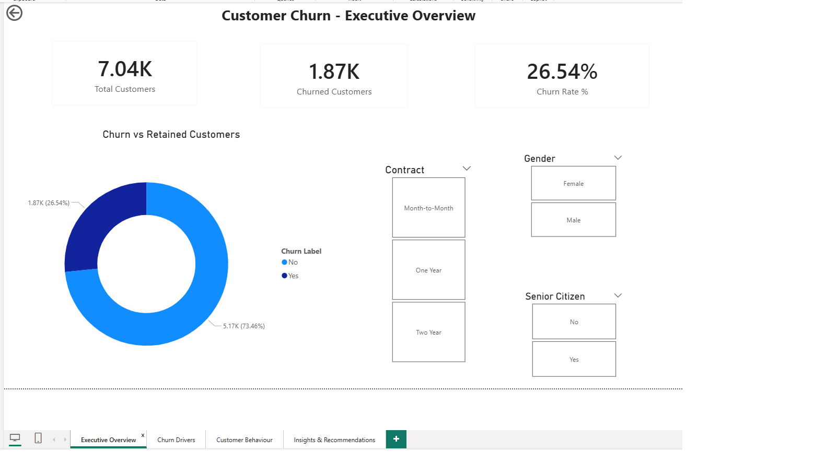
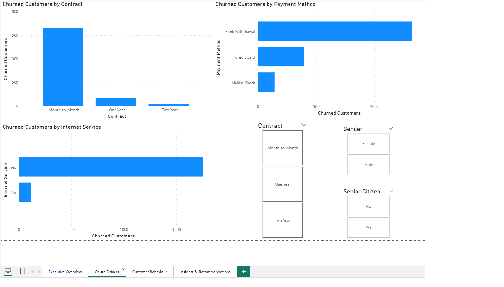
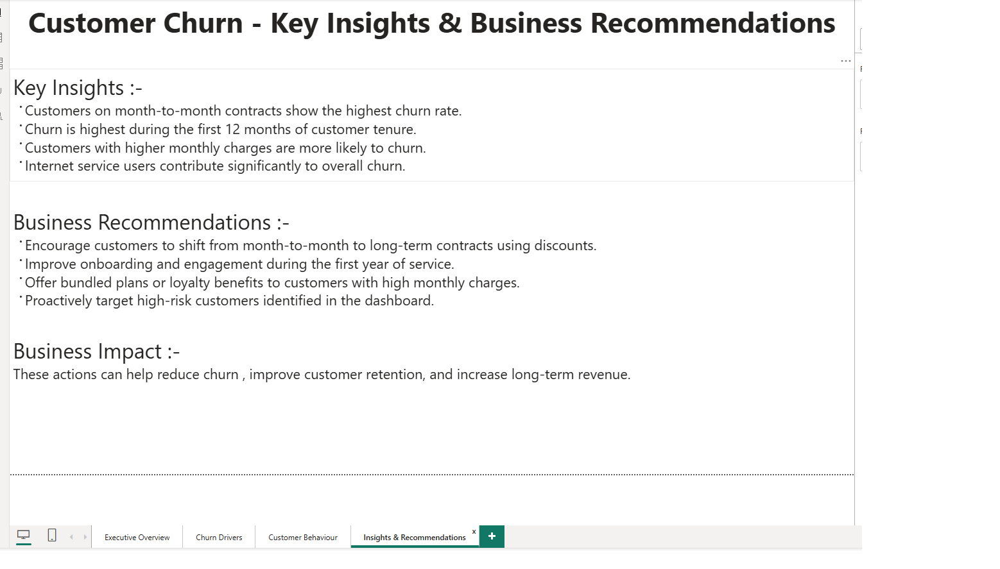

# 📊 Customer Churn Analysis – Power BI

## 📌 Project Overview
This project presents an end-to-end **Customer Churn Analysis** for a telecom company using **Power BI** and **Excel**.  
The goal is to identify churn patterns, understand key drivers of customer attrition, and provide actionable business recommendations to improve customer retention.

---

## 🎯 Objectives
- Analyze customer churn behavior
- Identify key churn drivers such as contract type, tenure, and monthly charges
- Detect high-risk customers likely to churn
- Provide data-driven business recommendations

---

## 🧰 Tools & Technologies
- Power BI
- Microsoft Excel
- DAX (Data Analysis Expressions)

---

## 📂 Dataset
- **Dataset:** Telco Customer Churn
- **Records:** ~7,000 customers
- **Features include:**
  - Customer demographics
  - Contract and payment information
  - Service usage
  - Churn status

---

## 📊 Dashboard Pages

### 1️⃣ Executive Overview
- Total Customers
- Churned Customers
- Churn Rate %
- Churn vs Retained Customers
- Interactive slicers (Contract, Gender, Senior Citizen)

---

### 2️⃣ Churn Drivers
- Churn by Contract Type
- Churn by Payment Method
- Churn by Internet Service

---

### 3️⃣ Customer Behavior
- Churn Rate by Customer Tenure
- Churn Rate vs Monthly Charges (binned analysis)

---

### 4️⃣ High-Risk Customers
- Identifies customers with:
  - Churn = Yes
  - Tenure < 12 months
- Helps businesses proactively target customers likely to churn

---

### 5️⃣ Insights & Recommendations
- Summarizes key findings
- Provides actionable business strategies to reduce churn

---

## 🔍 Key Insights
- Customers on **month-to-month contracts** have the highest churn rate
- **Churn is highest during the first 12 months** of customer tenure
- Customers with **higher monthly charges** are more likely to churn
- Internet service users contribute significantly to overall churn

---

## 💡 Business Recommendations
- Encourage customers to shift from **month-to-month to long-term contracts** using discounts
- Improve **onboarding and engagement** during the first year of service
- Offer **bundled plans or loyalty benefits** to customers with high monthly charges
- Proactively target **high-risk customers** identified in the dashboard

---

## 📈 Business Impact
Implementing these recommendations can help reduce customer churn, improve customer retention, and increase long-term customer lifetime value.

---

## 📁 Files Included
- `Customer_Churn_Analysis.pbix`
- Dashboard screenshots
- `README.md`

---

## 👤 Author
**Yashvi**  
